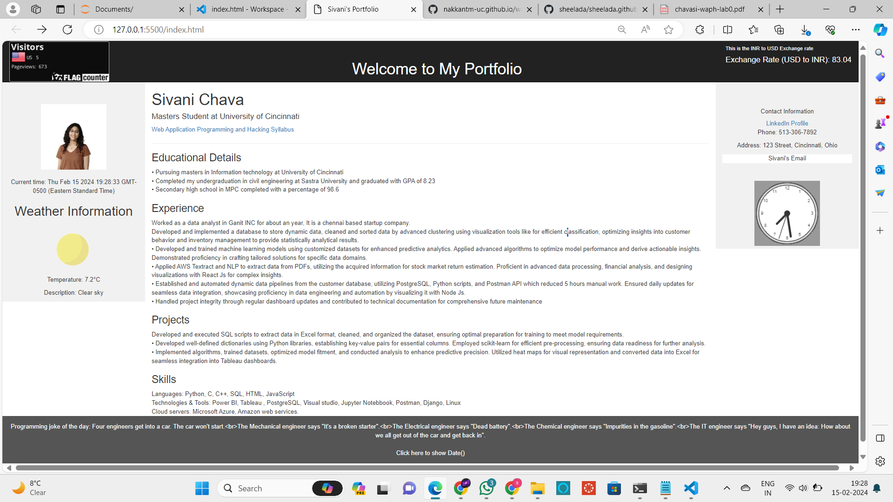
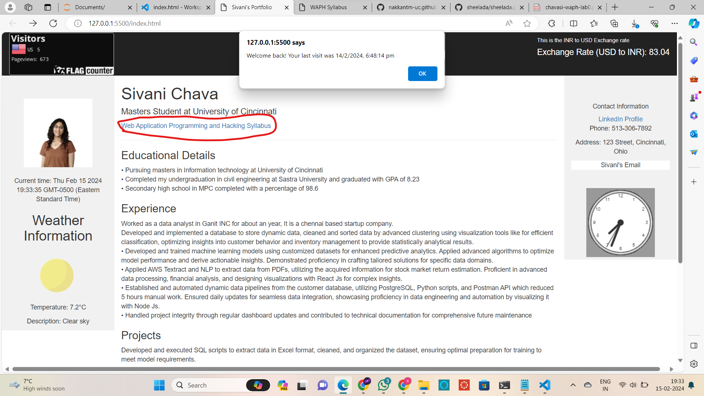
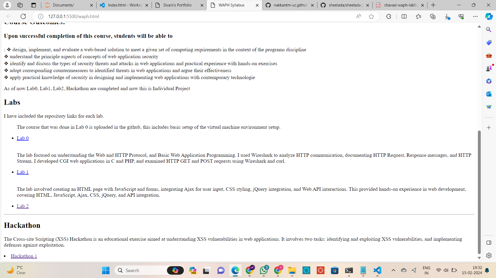
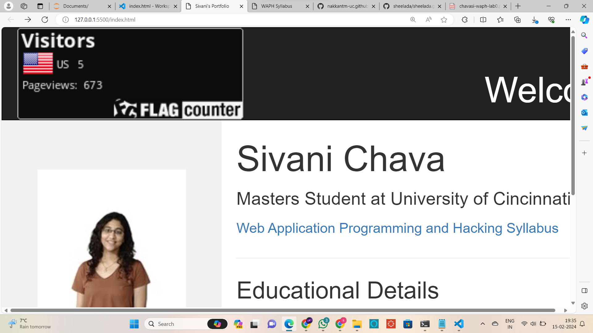
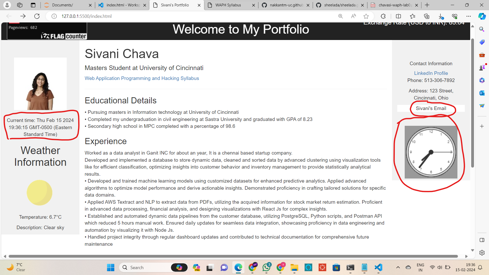
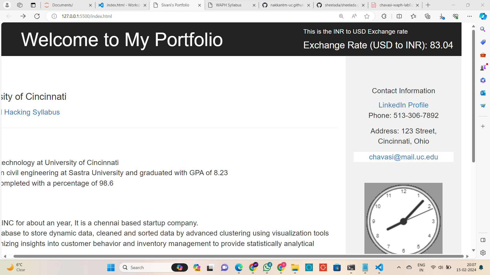
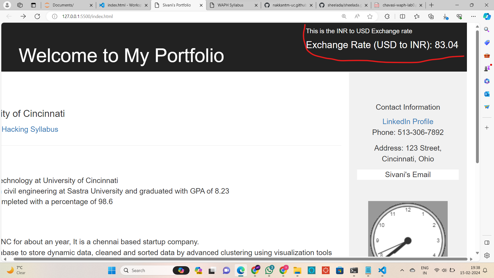
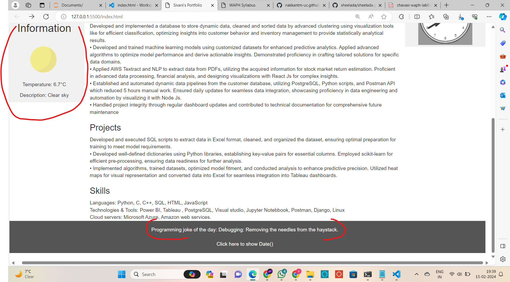
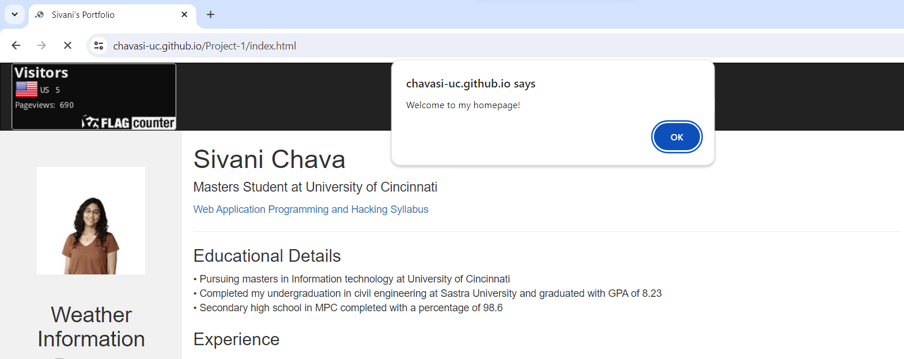
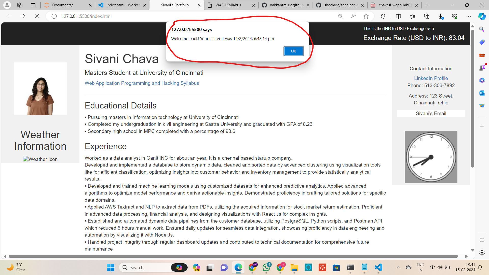

# WAPH-Web Application Programming and Hacking

## Instructor: Dr. Phu Phung

**Name**: Sivani Chava

**Email**: chavasi@mail.uc.edu

**Short-bio**: Iam sivanichava.I have experience of an year as a data analyst. Intrested in solving sophisticated problems.Currently pursuing masters in University of Cincinnati.   

{ width=150px height=150px }

## Repository Information

Respository's URL: [git@github.com:chavasi-uc/waph-chavasi-uc.git](git@github.com:chavasi-uc/waph-chavasi-uc.git)

This is a public repository for Sivani Chava to store all code from the course. The organization of this repository is as follows.

# Individual Project 1 – Front-end Web Development with a Professional Profile Website on github.io cloud service

## Overview and Requirements 

In this project, I have included the parts of functionality codes from previous labs that includes, analog clock, digital clock and Email, Joke API. I have also included 2 other API'S information namely Weather and react framework associated Exchange-rate API. My webpage in this project along with the aforementioned information showcases my resume which includes skills, experiences. Along with these elements i have included a page tracker, that counts and displays number of times the webpage was seen among different regions around the globe.

The link to access my website is: [https://chavasi-uc.github.io/Project-1/index.html](https://chavasi-uc.github.io/Project-1/index.html).

The link to access Individual Project-1 is: [https://github.com/chavasi-uc/chavasi-uc.github.io](https://github.com/chavasi-uc/chavasi-uc.github.io).

\pagebreak

## General Requirements

### Personal Website on Github.io

I created a new public repository with the name `chavasi-uc.github.io`. I developed a personal website hosted on GitHub Pages showcasing my resume, contact details, educational background, professional experiences, projects, certifications, and skills

The link to access my website is: [https://chavasi-uc.github.io/Project-1/index.html](https://chavasi-uc.github.io/Project-1/index.html).



\pagebreak

### "Web Application Programming and Hacking" course and related hands-on projects on waph.html file

I've added a dedicated page named 'waph.html' to my repository, providing an introduction to the 'Web Application Programming and Hacking' course along with its associated hands-on projects. This includes summaries of Lab0, Lab1, Lab2, Hackathon 1, and Individual Project 1.

The link to access waph.html is: [https://chavasi-uc.github.io/waph.html](https://chavasi-uc.github.io/waph.html).

As shown below the page is accessible.





\pagebreak

## Non-technical requirements

### Bootstrap Template

I have downloaded a bootstrap template from the website `https://www.w3schools.com/bootstrap/bootstrap_templates.asp` 
And added changes according to the professor instructions.

### Page Tracker

I've incorporated Flag Counter as a page tracker to monitor website visits and engagement. After evaluating options, I selected `https://flagcounter.com/` as the platform. I obtained a key from the website and seamlessly integrated it into my code. Now, Flag Counter is visibly integrated into the homepage of my website, allowing for easy tracking of visits and engagement.

Code for integrating Flag Counter:

```html
<div class="navbar-header text-center" id="headerwelcome"> 
      <a href="https://info.flagcounter.com/6f21"></a>    
</div>
```

  

\pagebreak

## Technical requirements

### A digital clock; An analog clock; show/hide your email:

Same as lab 2, Implemented a digital clock and an analog clock using JavaScript to display current time and also added functionality to show/hide the email address based on user interaction.

Source Code for digital clock:
```JS
function displayTime() {
          document.getElementById('digital-clock').innerHTML = "current time:" + new Date();
        }
        setInterval(displayTime, 500);
```

Source Code for Analog clock:
```JS
<canvas id="analog-clock" width="150" height="150" style="background-color:#999"></canvas>

      <script src="https://waph-uc.github.io/clock.js"></script>
      <script> var canvas = document.getElementById("analog-clock");
      var ctx = canvas.getContext("2d");
      var radius = canvas.height / 2;
      ctx.translate(radius,radius);
      radius = radius * 0.90
      setInterval(drawClock, 10);

      function drawClock(){
          drawFace(ctx, radius);
          drawNumbers(ctx, radius);
          drawTime(ctx,radius);
      }
      </script>
```

\pagebreak

Source Code for show/hide your email:

```JS
function showhideEmail() {
      if (shown) {
        document.getElementById('email').innerHTML = "Click here to show my email";
        shown = false;
      }
      else {
        var myemail = "<a href='mailto:chavasi-uc" + "@" + "mail.uc.edu'>chavasi-uc" + "@" + "mail.uc.edu</a>";
        document.getElementById('email').innerHTML = myemail;
        shown = true;
```

Screenshot Showing Digital clock, Analog Clock, Show/hide your email:




\pagebreak

### One more Functionality of my choice

I have integrated Currency exchange rate Api using `REACT.JS` Framework. This Api displays current exchange rate of the currency, by default i have USD to INR. 

Source code for Haacker news Api:
```JS
<script src="https://cdn.jsdelivr.net/npm/vue@2"></script>
```
 ```JS
<script type="text/babel">
    function ExchangeRate() {
      const [exchangeRate, setExchangeRate] = React.useState(null);
      const [error, setError] = React.useState(null);

      React.useEffect(() => {
        const apiKey = 'faa4bf4f162247c9a257f5fc07d1facd';

        axios.get("https://api.exchangerate-api.com/v4/latest/USD", {
          params: { access_key: apiKey }
        })
        .then(response => {
          const data = response.data;
          if (data && data.rates) {
            const exchangeRate = data.rates.INR.toFixed(2);
            setExchangeRate(exchangeRate);
          } else {
            setError("Unable to fetch exchange rate");
          }
        })
        .catch(error => {
          setError("Error occurred while fetching exchange rate");
        });
      }, []);

      return (
        <div id="root">
          {exchangeRate ? `Exchange Rate (USD to INR): ${exchangeRate}` : error}
        </div>
      );
    }

    ReactDOM.render(
      <ExchangeRate />,
      document.getElementById('root')
    );
  </script>
 ```
 \pagebreak



\pagebreak

### Joke API

Integrated the jokeAPI to fetch a new joke every minute and display it on the website.

Source code for Joke API:

```JS
<script> 
function JokeAPI(){

// function for JOKE API
function printResult(result) {
    $("#response").html(encodeInput(result));
   } 
   function encodeInput(input){
    const encodeData=document.createElement('div');
    encodeData.innerText=input;
    return encodeData.innerHTML;
	}
$.get("https://v2.jokeapi.dev/joke/Programming?type=single",function(result) {
    console.log("from the joke api : "+ JSON.stringify(result));
    if (result && result.joke){
        var encodedJoke=encodeInput(result.joke);
        $("#response").text("Programming joke of the day: "+encodedJoke);
    }
else{
    $("#response").text("can't get the joke");

}});
}
JokeAPI();
setInterval(newJoke,60000);
</script>
```
\pagebreak

### Weather API

I've integrated the Weatherbit API to retrieve current weather data for Cincinnati and display it on my website. Visitors can now easily access up-to-date weather information directly from the homepage.

```JS
<h2>Weather Information</H2>
      <div id="weather-info">
        <!-- Weather icon will be displayed here -->
        
        <div id="weather-details"></div>
      </div>
      <script>
        $(document).ready(function () {
        var apiKey = 'f85b577a771d49e990a4bb9613a29735'; 
        // Make a GET request to Weatherbit API for current weather data
        $.get("https://api.weatherbit.io/v2.0/current", {
            key: apiKey,
            city: 'Cincinnati' // Example city, you can change it to any city you want
        })
            .done(function (data) {
                // Check if the request was successful and data is available
                if (data && data.data && data.data.length > 0) {
                    var weatherData = data.data[0];
                    var temperature = weatherData.temp;
                    var description = weatherData.weather.description;
                    var iconCode = weatherData.weather.icon;

                    // Construct the URL for the weather icon
                    var iconUrl = "https://www.weatherbit.io/static/img/icons/" + iconCode + ".png";

                    // Display weather information on the webpage
                    $("#weather-icon").attr("src", iconUrl);
                    $("#weather-details").html("<p>Temperature: " + temperature + "°C</p>" +
                        "<p>Description: " + description + "</p>");
                } else {
                    $("#weather-info").html("<p>Unable to fetch weather data.</p>");
                }
            })
            .fail(function () {
                $("#weather-info").html("<p>Error occurred while fetching weather data.</p>");
            });
    });
     </script>
    </div>
```
\pagebreak



\pagebreak

### Javascript Cookies

I've implemented JavaScript cookies to enhance user experience on my website. Now, when a user visits the site for the first time, they receive a warm welcome message: "Welcome to my homepage!". For returning visitors, a personalized message is displayed: "Welcome back! Your last visit was (last visit time and date)". This feature helps create a more engaging and personalized experience for users.

```JS
// Function to set or retrieve the value of a cookie
function setCookie(name, value, days) {
var expires = "";
if (days) {
  var date = new Date();
  date.setTime(date.getTime() + (days * 24 * 60 * 60 * 1000));
  expires = "; expires=" + date.toUTCString();
}
document.cookie = name + "=" + (value || "") + expires + "; path=/";
}

function getCookie(name) {
var nameEQ = name + "=";
var ca = document.cookie.split(';');
for (var i = 0; i < ca.length; i++) {
  var c = ca[i];
  while (c.charAt(0) === ' ') c = c.substring(1, c.length);
  if (c.indexOf(nameEQ) === 0) return c.substring(nameEQ.length, c.length);
}
return null;
}

// Function to display the welcome message
function displayWelcomeMessage() {
var lastVisit = getCookie("lastVisit");
if (!lastVisit) {
  // First-time visit
  setCookie("lastVisit", new Date().toISOString(), 30); // Set cookie to expire in 30 days
  alert("Welcome to my homepage!");
} else {
  // Returning visit
  var lastVisitDate = new Date(lastVisit);
  alert("Welcome back! Your last visit was " + lastVisitDate.toLocaleString());
}
}

// Call the function when the page loads
window.onload = displayWelcomeMessage;
```
\pagebreak




\pagebreak


